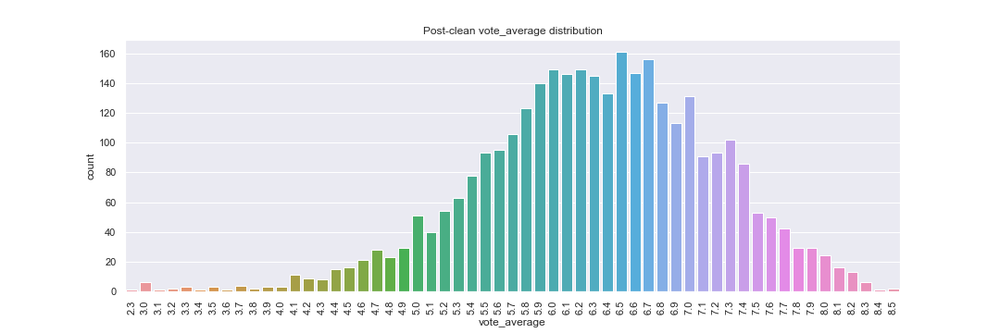
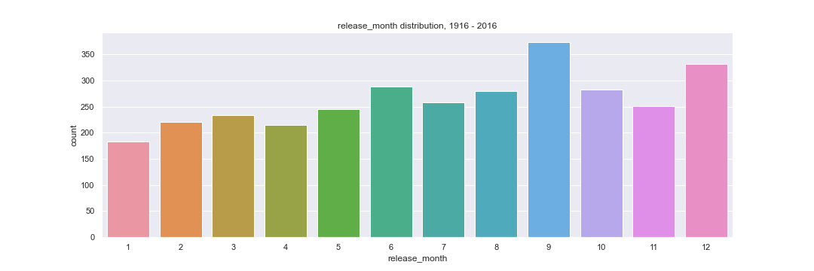
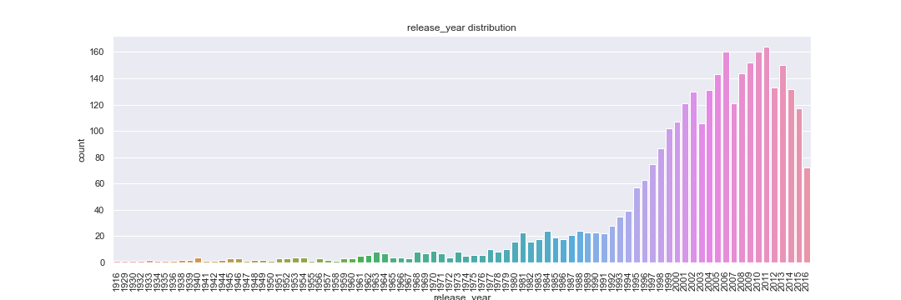
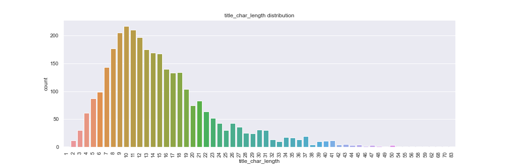
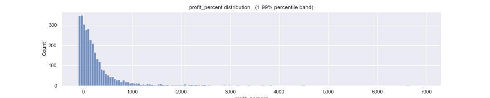
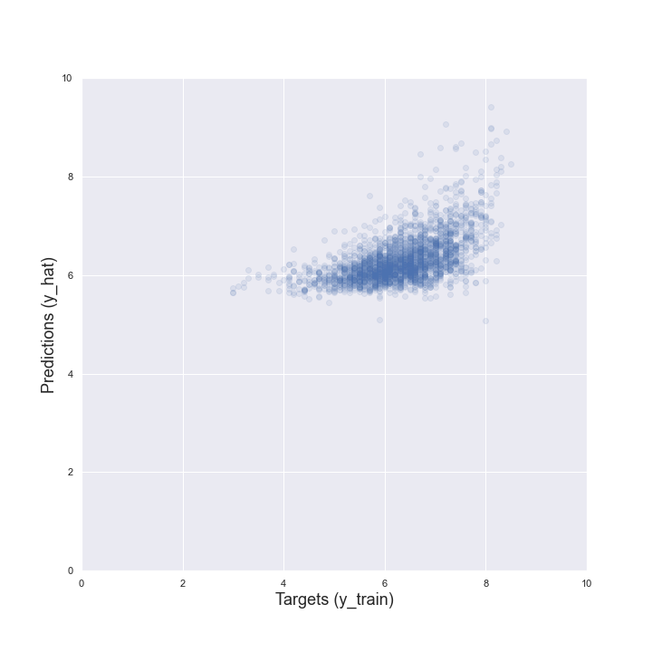
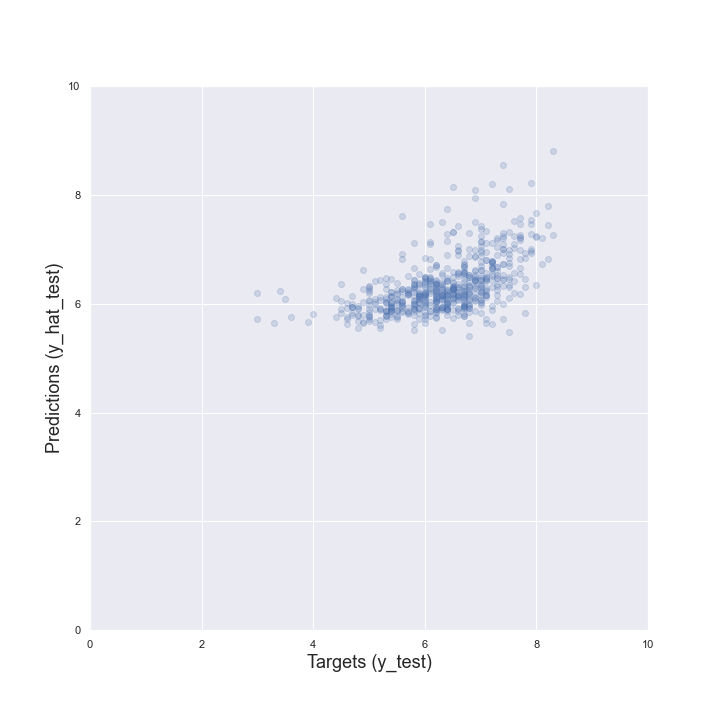

# movie_and_series_data
Analyze movie and series data from the database:
https://www.kaggle.com/tmdb/tmdb-movie-metadata

Skill Keywords: Python(Jupyter, Pandas, Matplotlib/Seaborn, Numpy), Data Cleaning, Exploratory data analysis

# Questions asked
Q1. What independent variable data are estimators in regression analysis for dependent variable 'vote_average' (0-10 rating of movie) 
Q2. Is there a connection between movie release month (Can be extracted from 'release_date') and 'vote_average'? When is the best month to release a movie to get a high score? 
Q3. When is the most common release month for movies? 

# Work
See "regression_analysis.ipynb"
Linear regression for target 'vote_average' (Movie score 0-10) was performed with these input variables (features): 
'popularity', 'runtime', 'vote_count', 'profit_percent', 'title_char_length', 'release_year', 'release_month_x'(11 month variables)

The below columns had to be wrangled out from original database: 
'profit_percent', 'title_char_length', 'release_year', 'release_month_x'(11 variables for months)

'profit_percent' was chosen over 'budget' or 'revenue' since it is not affected by inflation.

Data was split with a 80-20% split between training and test.

# Exploratory data analysis

# Linear regression result
The R-squared of the model was low, showing the model is not yet mature enough:  
0.3127 

 
The resulting scaled weights can infer what makes a movie score a higher 'vote_average'.  
Personal note: It might be difficult to predict a very subjective movie score ('vote_average')

Resulting scaled weights: 
The weights show these relationships between target and inputs 
'runtime':        Longer movies = higher vote_average 
'vote_count':     More votes = higher vote_average 
'profit_percent': More profitible = higher vote_average 
'release_year':   Older movies = higher vote_average 
'release_month':  Movies released in September = Slightly higher vote_average 

# Conclusions
Q1. 'vote_count', followed by 'runtime' had the strongest weight on the target 'vote_average' (0-10 rating of movie). 
Q2. September month seems to historically had the highest score 'vote_average' (0-10 rating of movie). 
Q3. September month was also the most common month for movies to be released. 

# Future possible work:
1. Inflation adjust 'budget' and 'revenue' and use as input.

# Misc notes
Popularity is defined by  
https://developers.themoviedb.org/3/getting-started/popularity